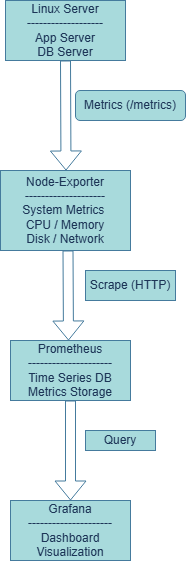
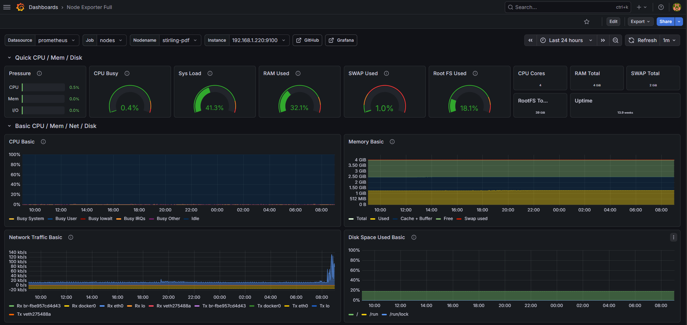
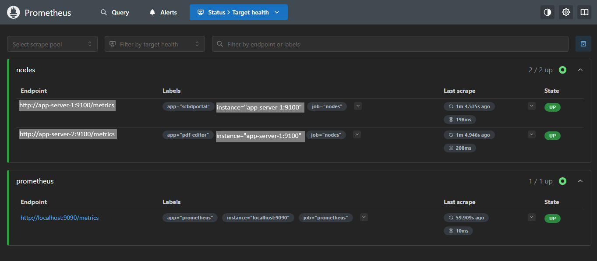

# DevOps Monitoring Stack

This project demonstrates a basic infrastructure monitoring stack using **Prometheus**, **Grafana**, and **Node Exporter**.

The stack collects system metrics from Linux servers, stores them in Prometheus, and visualizes them using Grafana dashboards.

---

## Architecture

Linux servers expose system metrics through **Node Exporter**.  
**Prometheus** periodically scrapes these metrics and stores them as time-series data.  
**Grafana** connects to Prometheus and visualizes the metrics through dashboards.

---

## Technologies

- Prometheus
- Grafana
- Node Exporter
- Linux

---

## Monitoring Screenshots

### Grafana Dashboard

Example Grafana dashboard showing system metrics such as CPU usage, memory usage, and disk utilization.

---

### Prometheus Targets

Prometheus successfully scraping metrics from Node Exporter instances running on monitored servers.

---

## Repository Structure

---

## Purpose

This repository demonstrates a simple **monitoring and observability setup for Linux infrastructure** using open-source tools commonly used in DevOps environments.